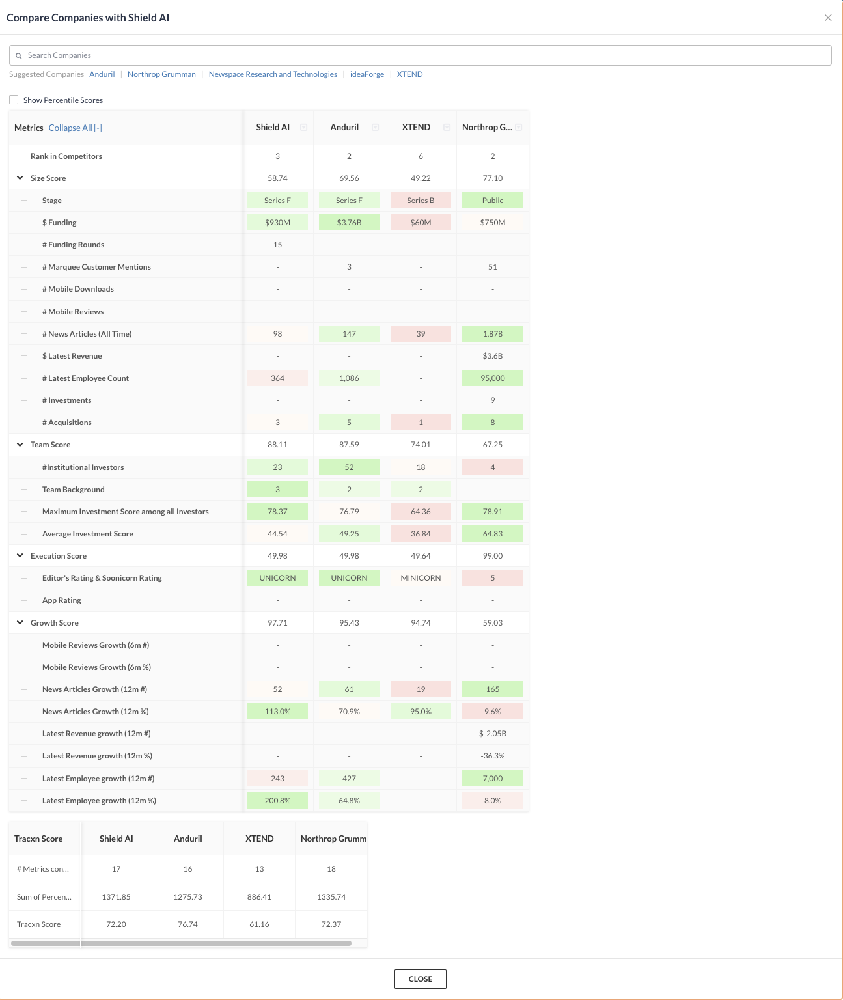

# AI-CASE-STUDY

**_Module 1 Challenge. Learning how to write a comprehensive README.md using a README.md template and existing AI companies as case study_**

- [Shield AI](https://shield.ai/)

- Shield AI was incorporated in 2015.

## **Founders**

- CEO & CO-Found [Ryan Tseng](https://shield.ai/about-us/company-executives/ryan-tseng/)
- PRESIDENT & CO-Found [Brandon Tseng](https://shield.ai/about-us/company-executives/brandon-tseng/)

## _Origin Story_

While serving with SEAL team 5 & 7 President and co-founder [Brandon Tseng](https://shield.ai/about-us/company-executives/brandon-tseng/) saw first hand the heavy toll bad intel, loss of communication, or having to follow orders based on incomplete information could lay at the feet of men on the ground. When Brandon started Shield AI in 2015 his mission was to build the best autonomous battle ready AI to aid and project soldiers in the field.

## Funding

Shield AI is funded through various capital ventures, notably [Andreessen Horowitz](https://a16z.com/) and [Homebrew](brew.sh). Their latest [Series F funding](https://markets.businessinsider.com/news/stocks/shield-ai-raises-200m-reaching-2-7b-valuation-1032759153) has them valued at $2.7B.

## Mission Statement

> "Our mission is to protect service members and civilians with intelligent systems."

## Audience

Shield AI focuses mostly on making systems for the **civilian** and **military** defense forces.

While Shield AI may not be th first defense focused AI company. There competitors, such as [Northrop Grumman](https://www.northropgrumman.com/what-we-do/artificial-intelligence-and-machine-learning), and [Anduril](https://www.anduril.com/), while big names in the game they don't have Shield AI's simplified vision and goal. Shield AI's [Hivemind](https://shield.ai/hivemind/) however is a world first. Being able to communicate to other AI craft autonomously.

## Proprietary Technologies

- [Sentient Tracker](https://shield.ai/sentient-tracker/)
- [ViDAR](https://shield.ai/vidar/)
- [Hivemind](https://shield.ai/hivemind/)
- [V-Bat](https://shield.ai/v-bat/)
- [Nova-2](https://shield.ai/nova-2/)

## Industry Focus

Shield AI mainly focuses on civilian and military defense but their scope extends to [deep tech](https://builtin.com/artificial-intelligence/deep-tech), Military Drones, Unmanned Surveillance Vehicles, and Drone Surveillance

## Industry Trends

Over the last 10 years AI and military defense have seen dramatic changes. Mostly in the form of increased integration of AI into various defense systems such as the development of [autonomous vehicles](https://www.tesla.com/), [swarm systems](https://shield.ai/nova-2/), [AI-powered decision support](https://www.palantir.com/), [human-AI team-ups](https://shield.ai/hivemind/), and [AI in surveillance](https://smartsentryai.com/).

## Other Major Players

- [Anduril Industries](https://www.anduril.com/): Offers defense products including drones, surveillance systems and technologies for border control

- [AeroVironment](https://www.avinc.com/): Industry veteran with decades of experience building unmanned arial systems (UAS)

- [Skydio](https://www.skydio.com/): Mostly known for making consumer drones Skydio also has defense contracts

- [Newspace Research and Technologies](https://newspace.co.in/): Fastest growing aerospace and defense R&D company to come out of India

- [XTEND](https://www.xtend.me/): Developes solutions for complex multi-mission objectives including pick-n-drops, vision assistance, and semi-autonomous interceptions

## Impact

Shield AI currently holds 10% of the market share in military and autonomous drone industry.

Shield AI has directly impacted the speed of military adoption. Their focus on creating fully autonomous AI devices that was work even in environments where GPS and communications are being jammed. This greatly increases the safety, ability, and engagement awareness for soldiers or police on the ground.

In September of 2023 Shield AI announced they had successfully completed a demonstration of their V-BATs Teaming protocol. Thus securing their next round of [AFWERX](https://afwerx.com/) Strategic Funding.

## Competitive Metrics

## Recommendations

One thing that I find missing from Shield AI's impressive portfolio is how to give the same ability to operate autonomously, without communications or gps, and in a hivemind capacity to the actual soldiers themselves.

It is not hard to imagine that one or all the devices in a V-BAT or Nova-2 deployment get destroyed. What intelligence do the soldiers have to rely on?

Shield AI would only have to utilize the IP they already have for their drones and apply it to the soldier. Similar to how they [teamed an AI with a human pilot using the F-16](https://shield.ai/jets/).

Shield AI has already shown they are capable of extending the use life of legacy war planes by augmenting them with their hivemind AI as a co-pilot. They technology they have already created has the potential to totally revolutionize war fare in unimaginable ways.

### Sources

- [Tracxn](https://tracxn.com/d/companies/shield-ai/__xWAZxcGRQErj0eca7RojeCvAoVKfcEIPX0V-RwwoAJk)
- [Shield AI](https://shield.ai/jets/)
- [Anduril Industries](https://www.anduril.com/)
- [AeroVironment](https://www.avinc.com/)
- [Skydio](https://www.skydio.com/)
- [Newspace Research and Technologies](https://newspace.co.in/)
- [XTEND](https://www.xtend.me/)
- [autonomous vehicles](https://www.tesla.com/)
- [AI in surveillance](https://smartsentryai.com/)
- [deep tech](https://builtin.com/artificial-intelligence/deep-tech)
- [Series F funding](https://markets.businessinsider.com/news/stocks/shield-ai-raises-200m-reaching-2-7b-valuation-1032759153)
- [Andreessen Horowitz](https://a16z.com/)
- [Homebrew](brew.sh)
- [Northrop Grumman](https://www.northropgrumman.com/what-we-do/artificial-intelligence-and-machine-learning)
